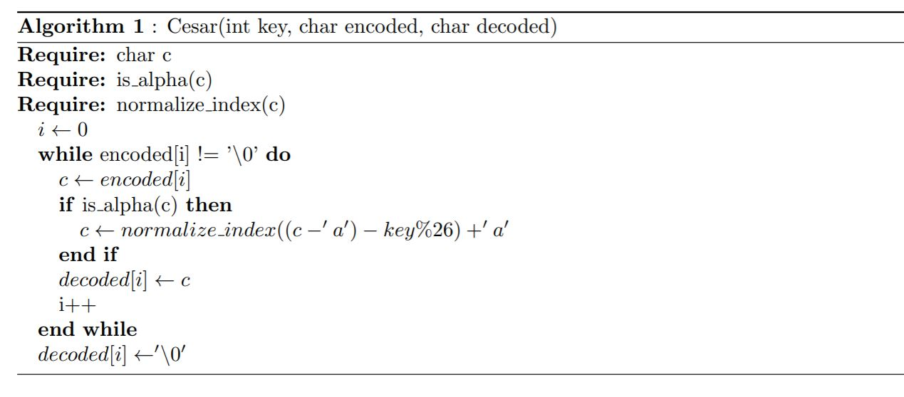
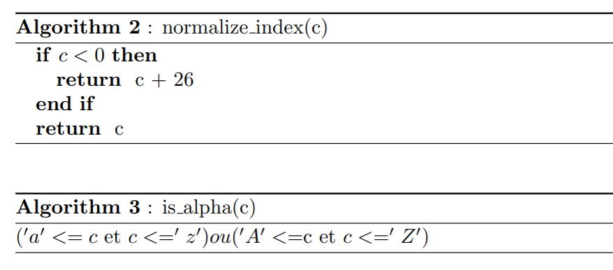
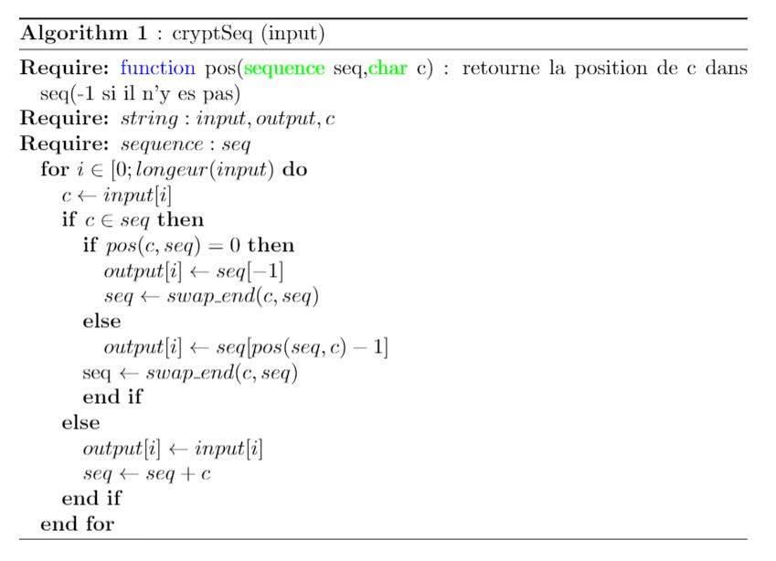
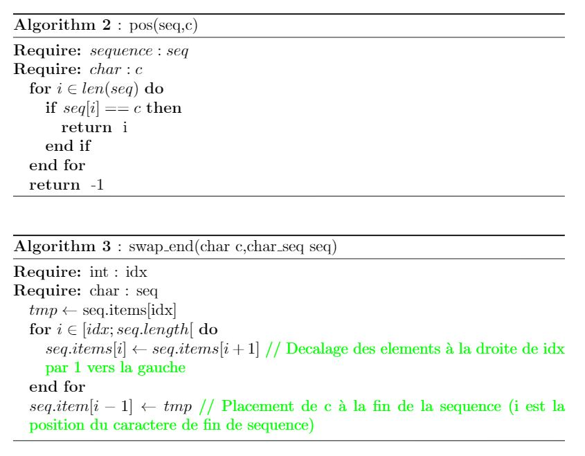
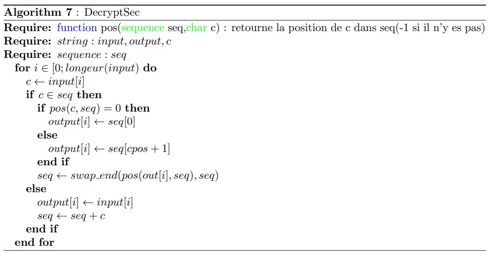
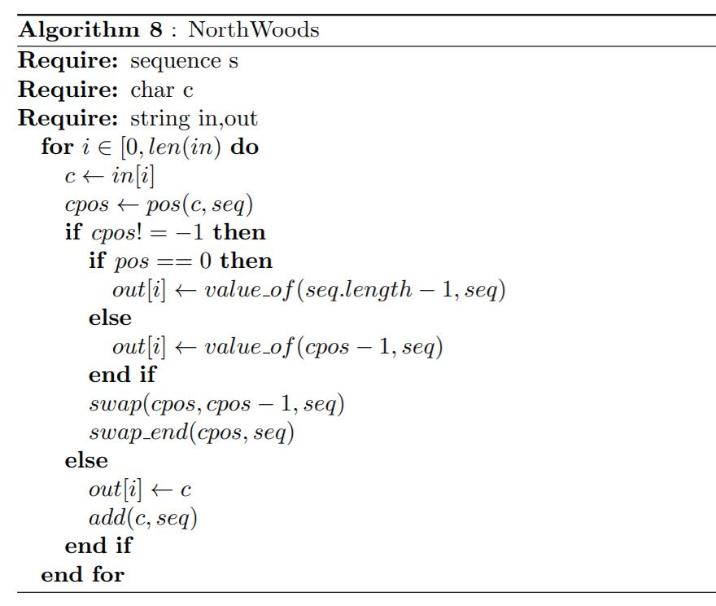

# Introduction
Voici les différents algorithmes qui ont été implémenté afin de compléter l'APP1. Des fonctions imporantes pour les différents algorithmes ont aussi été incluse pour plus de claretée.

Note : Tout les algorithmes ci dessous ont été réalisé sous LateX

# Cesar

## Algorithmes complémentaires

# cryptSeq

## Algorithmes complémentaires

# decryptSeq (avec cryptSeq ?)

# NorthWoods

